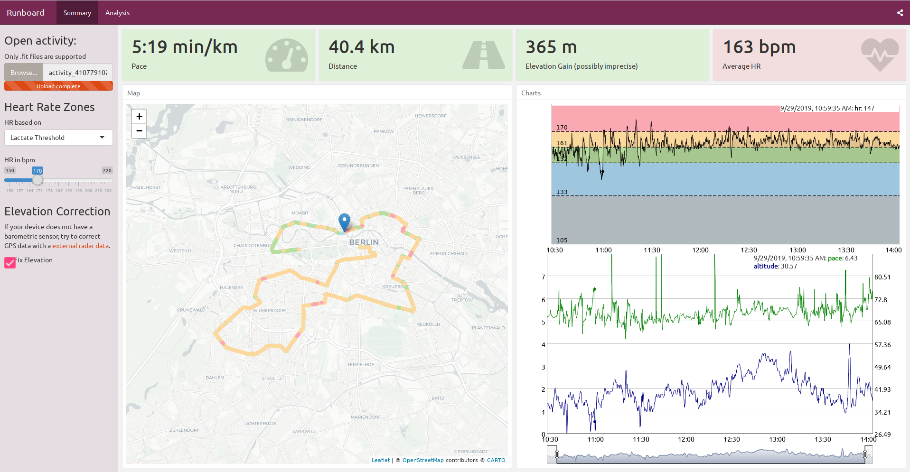
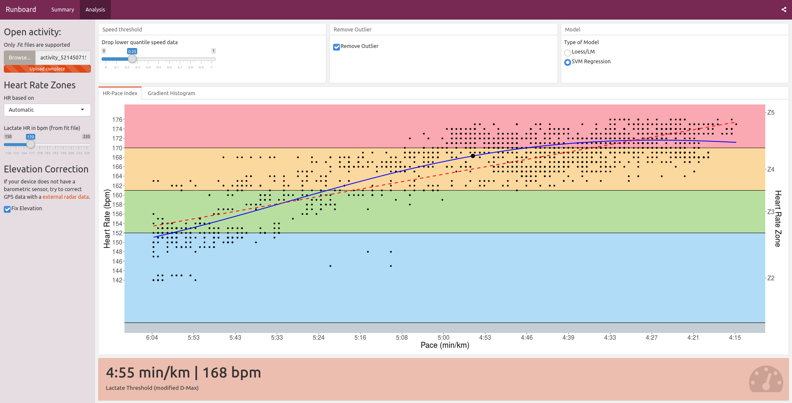

### Shiny Flexdashboard for my running activities

Try it here: https://galaxis.shinyapps.io/rundash/

It reads an activity (.fit file only) and outputs some charts around the
heart-rate data (HR zone chart, color coded tracks on a map etc). You can also
live-change the elevation data if your device doesn't have a barometric sensor.

It does *not* fix your .fit file, it only displays some data.

### Screenshots

##### Summary

##### Analysis (WIP)

